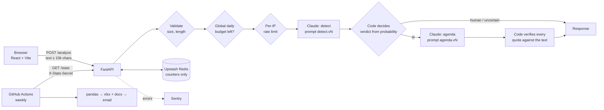

# Deslopify

Paste a text. Deslopify estimates whether it shows signs of AI generation and, if it does, reconstructs **what the author was trying to achieve**. Every claim about the author's agenda has to quote the pasted text, and code checks that the quote is really there. When the evidence is thin, it says "can't tell" instead of forcing a verdict.

> **AI-text detection is unreliable.** False accusations of "AI-written" hurt real people. Deslopify's output is a hint for a human to weigh, never proof. The UI says so on every result.

**Privacy:** pasted text is not stored by this app (not in a database, not in logs). It is sent to the Anthropic API for processing. Details are in the app footer and in [Privacy](#privacy).

## How it works



The same pipeline (`backend/app/pipeline.py`) is used by the API, the eval suite and the investigation agent.

## Design decisions: what the model does, what code does

| Concern | Who | Why |
|---|---|---|
| Judging structural AI signals, estimating `ai_probability` | Model | Fuzzy pattern recognition is what LLMs are for. |
| Turning probability into **ai / human / uncertain** | Code (`pipeline.decide`) | Thresholds are explicit, testable and tunable. The model cannot be talked into a verdict by text it reads. |
| Output shape | Code (Pydantic) | Model must return JSON that validates against a schema (range-checked probability, max lengths). One repair retry, then a clean 502. No free-text parsing. |
| Describing the author's agenda | Model | Interpretation needs language understanding. |
| **Checking that each claim is grounded** | Code (`verification.py`) | Each claim must carry a verbatim quote. Normalised substring match (case, whitespace, typographic quotes only). Unsupported tactics are dropped; if the core goal is unsupported the whole agenda is withheld. A hallucinated claim cannot reach the user. |
| Saying "can't tell" | Code (middle band of probability) | Forced verdicts on thin evidence are the harmful failure mode. |
| Prompt injection | Both | Prompt fences the text as `<untrusted_text>` data and tells the model to ignore embedded instructions and flag them; code neutralises a forged closing tag, decides the verdict itself, and the eval suite includes injection cases that must score 0% attack success. |
| Rate limits, daily spend cap, CORS, auth on `/stats` | Code only | Security controls never depend on model behaviour. |
| Investigation mode: *which* posts to compare, *what* the shared agenda is | Agent | Open-ended synthesis. |
| Investigation mode: quote checks, contradiction detection, halting, report | Code | The agent can't record an unverified finding or synthesise past a contradiction. |

Where AI is deliberately **not** used: access control, accounting, verdict thresholds, citation verification, report generation.

## Security notes

- **Client IP for rate limiting.** `X-Forwarded-For` is client-controlled on its left side, so it is read from the **right**: with `TRUSTED_PROXY_HOPS=N`, the client is the Nth entry from the right (what *our* proxy appended). `0` ignores the header. Spoofing tests are in `tests/test_api.py`. On Railway the right value is `2`, verified in production by comparing the Redis rate-limit keys with the caller's real IP (with `1` the keys were Railway edge proxy addresses, so all users shared two buckets). Verify this again if you change host.
- **Global spend breaker.** `DAILY_BUDGET_USD` stops all analyses once estimated daily spend is reached, independent of per-IP limits. Spend is estimated from token usage (conservative: cache discounts ignored). The check happens before the call, so a burst can overshoot by the in-flight requests.
- **`/stats`** is off (404) unless `STATS_SECRET` is set; the secret travels in the `X-Stats-Secret` header and is compared with `hmac.compare_digest`.
- **CORS** allows only `ALLOWED_ORIGINS` (POST + Content-Type). Set it to your frontend origin in production.
- **Input limits:** 10,000 chars (Pydantic `max_length`), 64 KB body cap, validation errors never echo the text.
- **Logging:** structured JSON with a request ID per request (returned as `X-Request-ID`); the pasted text and IPs are never logged. Sentry is initialised with `send_default_pii=False` and request bodies disabled.
- **Secrets:** `.env` is git-ignored, `.env.example` documents every variable, gitleaks and Semgrep run in CI, Dependabot is enabled.

## Evaluation

`backend/evals/` contains a labelled Polish set (12 AI-style, 12 human-style, plus 6 prompt-injection variants) and a runner that reports accuracy / precision / recall on decided items, abstention rate, **repeatability** (same text N times: probability spread, verdict flip rate), **injection attack success rate**, agenda-citation outcomes, cost and latency.

```bash
cd backend && pip install -r requirements.txt
export ANTHROPIC_API_KEY=...
python -m evals.run_eval --model claude-haiku-4-5-20251001 --repeats 3
python -m evals.compare_models claude-haiku-4-5-20251001 claude-sonnet-5-5
```

| Model | Prompts | Acc (decided) | Precision | Recall | Abstain | Inj. success | Flip rate | $/req | p95 s |
|---|---|---|---|---|---|---|---|---|---|
| `claude-haiku-4-5-20251001` | detect v1 / agenda v1 | 1.0 | 1.0 | 1.0 | 0.0 | 0.0 | 0.0 | $0.0032 | 9.5 |
| `claude-sonnet-5-5` | detect v1 / agenda v1 | 1.0 | 1.0 | 1.0 | 0.042 | 0.0 | 0.042 | $0.0096 | 12.1 |

Run on 2026-10-04, 24 clean items x 3 repeats + 18 injection runs per model. Agenda citations that passed verification on AI verdicts: Haiku 80% verified / 20% partial (some claims dropped), Sonnet 94% / 6%. Haiku had 1 of 90 requests fail with unparseable model JSON after the retry (1.1%). Raw results: `backend/evals/results/`.

> **Honest limits.** Perfect scores on a 24-item synthetic set mean the set is easy, not that the detector is 100% accurate: the texts were written in the *style* of AI and human posts, not sampled from the real world. Treat this as a regression and plumbing check (it would catch a broken prompt, a successful injection, or unstable verdicts), not as a real-world accuracy figure. Extend it with real, independently labelled texts before quoting accuracy. Model choice and rationale: [docs/MODEL_DECISION.md](docs/MODEL_DECISION.md).

Prompts are versioned files (`backend/app/prompts/<name>.<version>.md`); the active versions and the model are returned with, and logged for, every result. The eval runs only on demand (Actions tab → "Eval suite" → Run workflow, with a model input; needs the `ANTHROPIC_API_KEY` secret) because it spends API money. It gates on injection success and flip rate. Unit tests (no API calls) run on every PR.

## Investigation mode (Claude Agent SDK)

```bash
cd backend && pip install -r requirements-investigate.txt
python -m investigate posts/*.txt --out report.docx   # 2-10 text files
```

An agent analyses each post through the verified pipeline, looks for a shared agenda, and records findings only with verbatim quotes from each post (verified by code). If posts contradict each other (detected by code, or flagged by the agent) synthesis halts and the report is marked **ESCALATED: human review required**. The `.docx` is generated by code from verified state; the agent's own narrative is included but labelled unverified. Built-in file/shell/web tools are disabled; the agent only has the five investigation tools. CLI only, by design (cost). The deterministic parts are unit-tested; the live agent loop needs an API key and has not been exercised in CI.

## Operations

- `GET /health` for uptime monitors (e.g. UptimeRobot free plan pointed at it).
- Errors: timeouts, retries (SDK, 2x) and upstream failures map to clear UI messages with a reference ID; failed analyses don't consume the user's quota. Set `SENTRY_DSN` for alerts.
- Weekly report: `.github/workflows/weekly-report.yml` calls `/stats`, builds an xlsx and a docx with pandas / openpyxl / python-docx, and emails them (repo secrets: `STATS_URL`, `STATS_SECRET`, `SMTP_*`, `REPORT_FROM`, `REPORT_TO`).

## Local development

```bash
# backend
cd backend
python -m venv .venv && source .venv/bin/activate
pip install -r requirements-dev.txt
cp .env.example .env        # set ANTHROPIC_API_KEY
uvicorn app.main:app --reload
pytest                      # no API key needed (Anthropic and Redis are faked)
ruff check . && ruff format --check .

# frontend
cd frontend
npm install
npm run dev                 # http://localhost:5173
```

## Configuration

See `backend/.env.example` (every variable is documented there) and `frontend/.env.example` (`VITE_API_URL`, `VITE_SITE_URL` for absolute Open Graph URLs; on Vercel it falls back to the production domain).

## Deployment

- **Backend:** Railway (`backend/Procfile`). Set the variables from `.env.example`, especially `ALLOWED_ORIGINS`, `STATS_SECRET`, `DAILY_BUDGET_USD`.
- **Frontend:** Vercel, root directory `frontend/`.
- **Support:** a Ko-fi link in the footer. The site shows no ads and sets no cookies, so no consent banner is needed.

## Privacy

Not stored by this app: the text you paste. It is processed in memory and forwarded to the Anthropic API (governed by Anthropic's terms). Stored: anonymous aggregate counters and a per-IP daily request counter that expires within 24 hours. No cookies, no ads. Vercel Analytics provides cookieless page-view counts. Hosting providers may keep standard access logs.

## License

[MIT](LICENSE)
